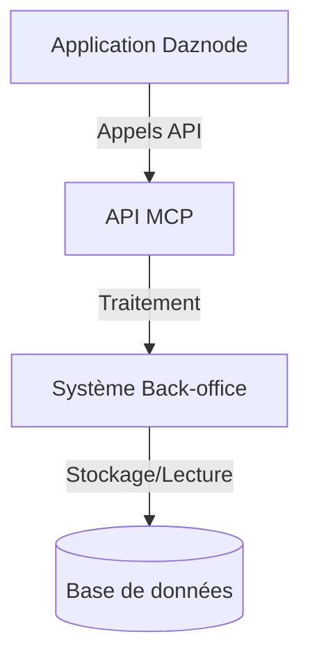

# Spécifications Fonctionnelles et Techniques : Système de Scoring Lightning Network

## Introduction
Ce document détaille les spécifications du service back-office et des points d'API destinés à l'application daznode. L'objectif est de fournir une interface robuste et performante pour la gestion et l'affichage des données de scoring du réseau Lightning.

## Architecture Globale


## Spécifications Fonctionnelles

### Système de Scoring
- **Métriques de centralité**
  - Degré de centralité
  - Centralité d'intermédiarité
  - Capacité totale
- **Indicateurs de performance**
  - Taux de disponibilité
  - Fiabilité des transactions
  - Temps de réponse moyen

### Analyses et Recommandations
- Optimisation des canaux
- Suggestions de connexions stratégiques
- Alertes de performance
- Opportunités d'amélioration du réseau

### Rapports et Visualisations
- Tableaux de bord personnalisables
- Graphiques de tendances
- Cartographie du réseau
- Rapports d'analyse comparative

## Spécifications Techniques

### Points d'API

#### Gestion des Scores
```typescript
GET /api/v1/lightning/scores
```
- **Description** : Récupère les scores de tous les nœuds
- **Paramètres** :
  - `page`: number (pagination)
  - `limit`: number (éléments par page)
  - `sort`: string (champ de tri)
  - `filter`: object (filtres)
- **Réponse** :
```json
{
  "data": [
    {
      "node_id": "string",
      "scores": {
        "centrality": number,
        "reliability": number,
        "performance": number
      },
      "timestamp": "string"
    }
  ],
  "metadata": {
    "total": number,
    "page": number,
    "limit": number
  }
}
```

```typescript
GET /api/v1/lightning/scores/{node_id}
```
- **Description** : Récupère les informations détaillées du score d'un nœud
- **Paramètres** :
  - `node_id`: string (identifiant du nœud)
- **Réponse** :
```json
{
  "node_id": "string",
  "detailed_scores": {
    "centrality": {
      "degree": number,
      "betweenness": number
    },
    "performance": {
      "uptime": number,
      "success_rate": number
    },
    "capacity": {
      "total": number,
      "average_per_channel": number
    }
  },
  "historical_data": [
    {
      "timestamp": "string",
      "score": number
    }
  ]
}
```

#### Gestion des Recommandations
```typescript
GET /api/v1/lightning/nodes/{node_id}/recommendations
```
- **Description** : Récupère les recommandations pour un nœud
- **Paramètres** :
  - `node_id`: string
  - `type`: string (type de recommandation)
- **Réponse** :
```json
{
  "node_id": "string",
  "recommendations": [
    {
      "type": "string",
      "description": "string",
      "priority": "high|medium|low",
      "impact_score": number,
      "implementation_difficulty": "string"
    }
  ]
}
```

#### Configuration du Scoring
```typescript
PUT /api/v1/lightning/scoring/config
```
- **Description** : Met à jour la configuration du scoring
- **Corps** :
```json
{
  "weights": {
    "centrality": number,
    "reliability": number,
    "performance": number
  },
  "thresholds": {
    "minimum_score": number,
    "alert_threshold": number
  }
}
```

#### Recalcul des Scores
```typescript
POST /api/v1/lightning/scores/recalculate
```
- **Description** : Déclenche un recalcul des scores
- **Corps** :
```json
{
  "node_ids": ["string"],
  "force": boolean
}
```

## Modèles de Données

### Node
```typescript
interface Node {
  id: string;
  alias: string;
  public_key: string;
  last_update: string;
  color: string;
  features: Feature[];
  addresses: Address[];
}
```

### Score
```typescript
interface Score {
  id: string;
  node_id: string;
  timestamp: string;
  metrics: {
    centrality: number;
    reliability: number;
    performance: number;
    composite: number;
  };
  metadata: {
    calculation_version: string;
    data_sources: string[];
  };
}
```

### Channel
```typescript
interface Channel {
  id: string;
  node1_pub: string;
  node2_pub: string;
  capacity: number;
  last_update: string;
  status: 'active' | 'inactive';
  fee_rate: number;
}
```

## Sécurité et Performance

### Sécurité
- Authentification JWT
- Rate limiting par IP et par token
- Validation des entrées
- Chiffrement des données sensibles
- Journalisation des accès

### Performance
- Mise en cache des résultats
- Pagination des résultats
- Optimisation des requêtes
- Indexation appropriée
- Compression des réponses

## Roadmap d'Implémentation

### Sprint 1 : Fondations (2 semaines)
- [ ] Mise en place de l'architecture de base
- [ ] Implémentation des modèles de données
- [ ] Configuration de la base de données

### Sprint 2 : API Core (3 semaines)
- [ ] Développement des endpoints principaux
- [ ] Implémentation du système de scoring
- [ ] Tests unitaires et d'intégration

### Sprint 3 : Optimisation (2 semaines)
- [ ] Mise en place du caching
- [ ] Optimisation des performances
- [ ] Documentation API

### Sprint 4 : Sécurité et Monitoring (2 semaines)
- [ ] Implémentation de la sécurité
- [ ] Mise en place du monitoring
- [ ] Tests de charge

## Considérations Techniques Supplémentaires

### Technologies Recommandées
- FastAPI pour l'API REST
- PostgreSQL pour la base de données
- Redis pour le caching
- Prometheus/Grafana pour le monitoring

### Maintenance
- Sauvegarde quotidienne des données
- Rotation des logs
- Monitoring proactif
- Mises à jour de sécurité régulières

## Conclusion
Ces spécifications fournissent un cadre complet pour l'implémentation du système de scoring et son intégration avec l'application daznode. L'approche par phases permettra une mise en œuvre progressive et maîtrisée des fonctionnalités. 