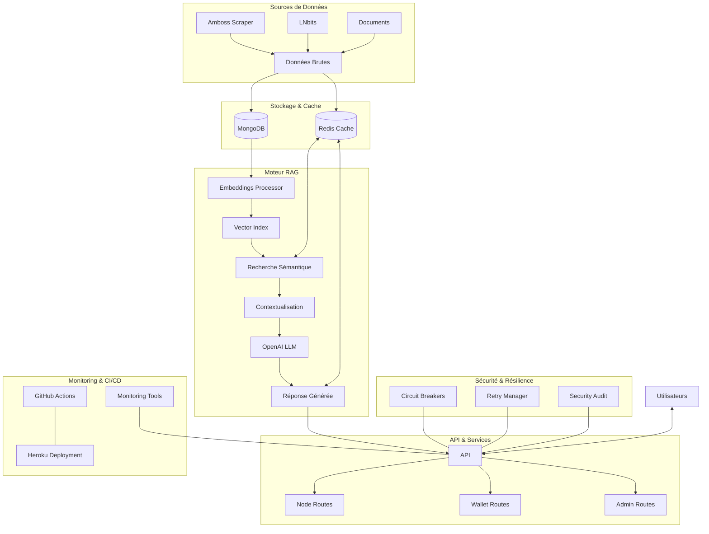
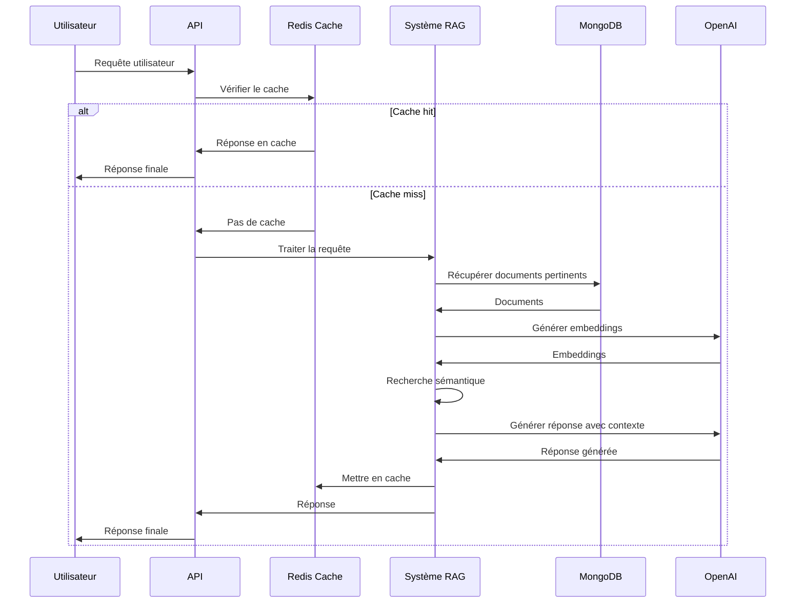
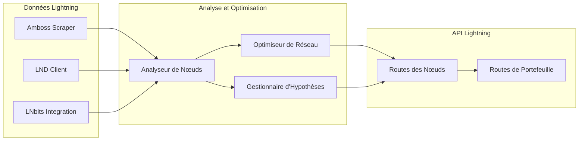
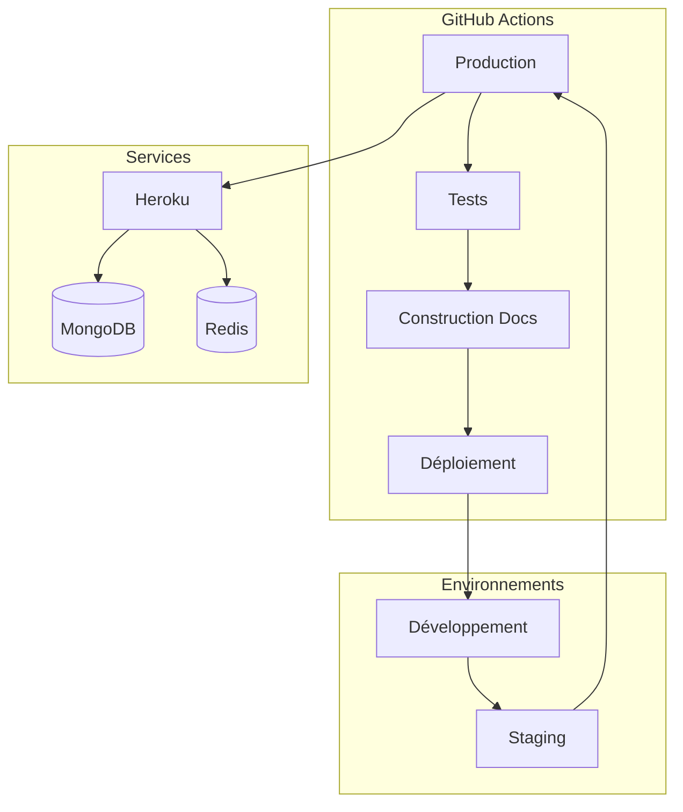

# Schéma d'Architecture du Système MCP

Ce document présente un schéma visuel de l'architecture du système MCP (Monitoring and Control Platform) et de son workflow RAG.

## Vue d'ensemble de l'Architecture

## Flux de Données RAG

## Composants du Système Lightning Network

## Workflow CI/CD

## Légende

- **Sources de Données**: Origines des données traitées par le système
- **Stockage & Cache**: Systèmes de persistance et mise en cache
- **Moteur RAG**: Composants du système de Retrieval-Augmented Generation
- **API & Services**: Points d'entrée pour les utilisateurs
- **Sécurité & Résilience**: Fonctionnalités assurant la robustesse du système
- **Monitoring & CI/CD**: Outils de surveillance et déploiement continu 