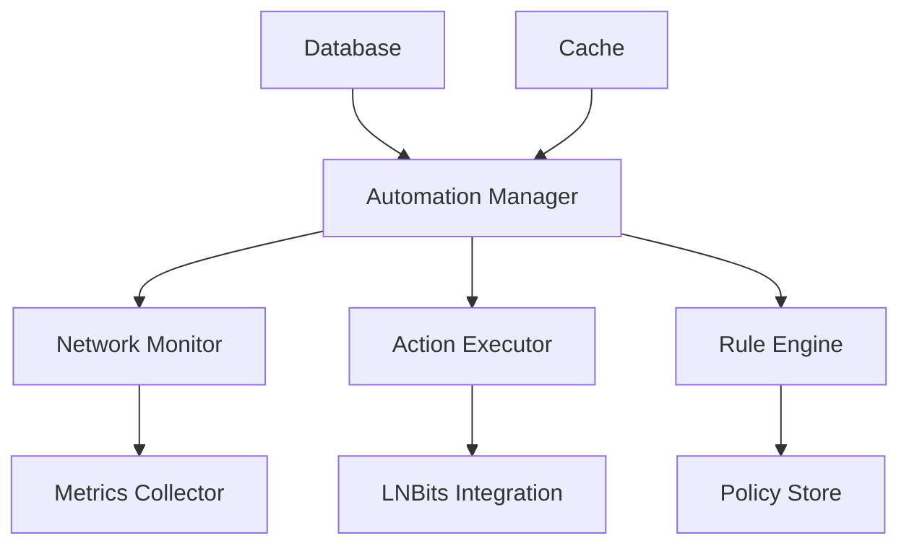

# Architecture du Système d'Automatisation

L'architecture du système d'automatisation est conçue pour permettre la gestion autonome et optimisée du réseau Lightning.

## Vue d'Ensemble



## Composants Principaux

### 1. Automation Manager
- Orchestration des composants
- Gestion du cycle de vie
- Coordination des actions
- Surveillance du système

### 2. Network Monitor
- Surveillance des canaux
- Détection des anomalies
- Collecte des métriques
- Alertes en temps réel

### 3. Action Executor
- Exécution des actions
- Gestion des erreurs
- Journalisation
- Retry mechanism

### 4. Rule Engine
- Évaluation des règles
- Prise de décision
- Application des politiques
- Gestion des priorités

### 5. LNBits Integration
- Gestion des paiements
- Création de factures
- Suivi des transactions
- Gestion des fonds

## Flux de Données

1. **Surveillance**
   ```python
   async def monitor_network(
       node_id: str,
       interval: int = 60
   ) -> None:
       while True:
           # Collecte des métriques
           metrics = await collect_metrics(node_id)
           
           # Analyse
           analysis = analyze_metrics(metrics)
           
           # Vérification des règles
           actions = await check_rules(analysis)
           
           # Exécution des actions
           if actions:
               await execute_actions(actions)
           
           await asyncio.sleep(interval)
   ```

2. **Exécution d'Actions**
   ```python
   async def execute_actions(
       actions: List[Action]
   ) -> None:
       for action in actions:
           try:
               # Validation
               if not await validate_action(action):
                   continue
               
               # Exécution
               result = await perform_action(action)
               
               # Journalisation
               await log_action(action, result)
               
           except Exception as e:
               await handle_error(action, e)
   ```

3. **Gestion des Règles**
   ```python
   async def evaluate_rules(
       metrics: Dict[str, Any]
   ) -> List[Action]:
       actions = []
       
       for rule in await load_rules():
           # Évaluation
           if await rule.evaluate(metrics):
               # Génération d'action
               action = await rule.generate_action()
               actions.append(action)
       
       return actions
   ```

## Configuration du Système

```yaml
automation:
  monitor:
    interval: 60
    metrics:
      - channel_balance
      - fee_rate
      - routing_volume
    thresholds:
      channel_balance: 0.2
      fee_rate: 0.1
  
  actions:
    retry:
      max_attempts: 3
      delay: 5
    timeout: 30
  
  lnbits:
    url: "https://lnbits.example.com"
    api_key: "your_api_key"
```

## Considérations de Performance

- **Latence** : Minimisation des délais d'action
- **Scalabilité** : Gestion de multiples nœuds
- **Fiabilité** : Tolérance aux pannes
- **Sécurité** : Protection des fonds

## Prochaines Étapes

- [Implementation](../automation/implementation.md)
- [Best Practices](../../guides/best-practices/automation-best-practices.md) 