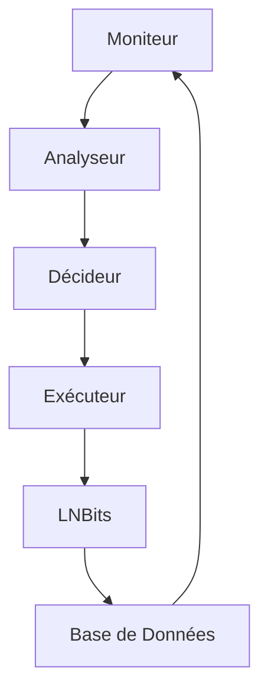

# Automatisation

Le système d'automatisation permet de gérer et d'optimiser le réseau Lightning de manière autonome, en appliquant des règles et des stratégies prédéfinies.

## Fonctionnalités Principales

- **Gestion Automatique des Frais** : Ajustement dynamique des frais
- **Rééquilibrage Intelligent** : Optimisation de la liquidité
- **Surveillance Continue** : Monitoring du réseau
- **Intégration LNBits** : Automatisation des paiements

## Architecture



## Composants Principaux

1. **Moniteur de Réseau**
   - Surveillance des canaux
   - Détection des anomalies
   - Métriques de performance

2. **Gestionnaire d'Actions**
   - Exécution des tâches
   - Gestion des erreurs
   - Journalisation

3. **Intégration LNBits**
   - Gestion des paiements
   - Création de factures
   - Suivi des transactions

## Exemple d'Utilisation

```python
from src import AutomationManager

async def automate_network(node_id: str):
    manager = AutomationManager()
    
    # Configuration
    await manager.configure(
        node_id=node_id,
        rules={
            "fee_optimization": True,
            "rebalancing": True,
            "monitoring": True
        }
    )
    
    # Démarrage de l'automatisation
    await manager.start()
    
    # Surveillance
    while True:
        status = await manager.check_status()
        if status.needs_action:
            await manager.execute_actions()
```

## Bonnes Pratiques

- Définir des règles claires
- Mettre en place des seuils de sécurité
- Maintenir un journal détaillé
- Tester les automatisations

## Prochaines Étapes

- [Architecture](../automation/architecture.md)
- [Implementation](../automation/implementation.md)
- [Best Practices](../../guides/best-practices/automation-best-practices.md) 