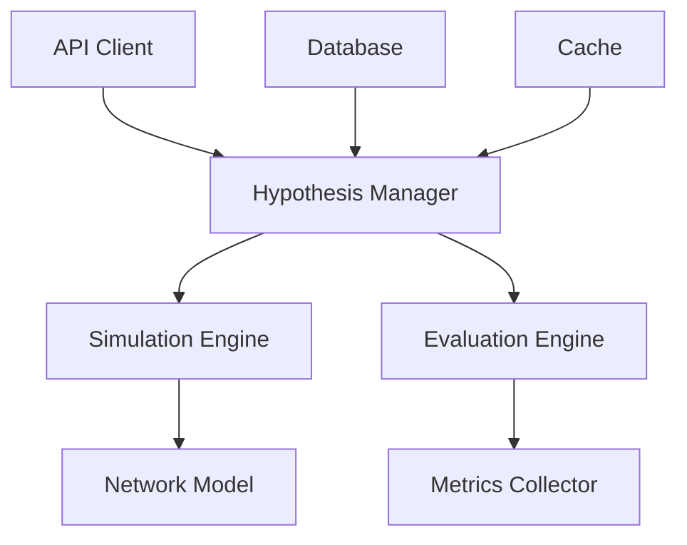

# Architecture du Système d'Hypothèses

L'architecture du système d'hypothèses est conçue pour permettre la simulation et l'évaluation sécurisée des changements dans le réseau Lightning.

## Vue d'Ensemble



## Composants Principaux

### 1. Hypothesis Manager
- Gestion du cycle de vie des hypothèses
- Orchestration des simulations
- Validation des résultats
- Historique des tests

### 2. Simulation Engine
- Modélisation du réseau
- Simulation des changements
- Calcul des impacts
- Gestion des scénarios

### 3. Evaluation Engine
- Analyse des résultats
- Calcul des métriques
- Génération de rapports
- Recommandations

### 4. Network Model
- Représentation du réseau
- État des canaux
- Topologie
- Métriques en temps réel

### 5. Metrics Collector
- Collecte des données
- Agrégation
- Stockage
- Analyse

## Flux de Données

1. **Création d'Hypothèse**
   ```python
   async def create_hypothesis(
       node_id: str,
       changes: Dict[str, Any]
   ) -> Hypothesis:
       # Validation
       if not await validate_changes(changes):
           raise InvalidHypothesisError()
       
       # Création
       hypothesis = Hypothesis(
           node_id=node_id,
           changes=changes,
           status=HypothesisStatus.PENDING
       )
       
       # Sauvegarde
       await db.save(hypothesis)
       
       return hypothesis
   ```

2. **Simulation**
   ```python
   async def simulate(
       hypothesis: Hypothesis
   ) -> SimulationResult:
       # Chargement du modèle
       model = await load_network_model(hypothesis.node_id)
       
       # Application des changements
       modified_model = apply_changes(model, hypothesis.changes)
       
       # Simulation
       result = await run_simulation(modified_model)
       
       # Sauvegarde
       await db.save(result)
       
       return result
   ```

3. **Évaluation**
   ```python
   async def evaluate(
       result: SimulationResult
   ) -> Evaluation:
       # Collecte des métriques
       metrics = await collect_metrics(result)
       
       # Analyse
       analysis = analyze_metrics(metrics)
       
       # Génération du rapport
       report = generate_report(analysis)
       
       return Evaluation(
           result=result,
           metrics=metrics,
           report=report
       )
   ```

## Configuration du Système

```yaml
hypothesis:
  simulation:
    max_iterations: 1000
    timeout: 300
    batch_size: 100
  
  evaluation:
    metrics:
      - performance
      - stability
      - revenue
    thresholds:
      performance: 0.8
      stability: 0.9
  
  storage:
    type: "mongodb"
    host: "localhost"
    port: 27017
    database: "hypothesis"
```

## Considérations de Performance

- **Latence** : Optimisation des simulations
- **Scalabilité** : Parallélisation des calculs
- **Précision** : Fidélité du modèle
- **Fiabilité** : Validation des résultats

## Prochaines Étapes

- [Implementation](../hypothesis/implementation.md)
- [Best Practices](../../guides/best-practices/hypothesis-best-practices.md) 