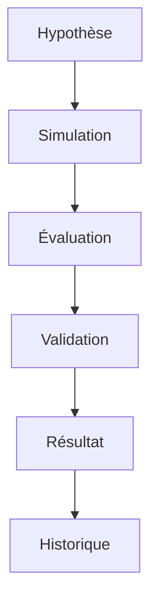

# Gestion des Hypothèses

Le système de gestion des hypothèses permet de simuler et d'évaluer les impacts potentiels des changements dans la configuration du réseau Lightning avant leur application.

## Fonctionnalités Principales

- **Simulation de Changements** : Test des modifications de frais et de configuration
- **Évaluation Prédictive** : Analyse des impacts potentiels
- **Validation Automatique** : Vérification de la faisabilité
- **Historique des Tests** : Suivi des simulations passées

## Architecture



## Types d'Hypothèses

1. **Changements de Frais**
   - Modification des frais de base
   - Ajustement des taux
   - Optimisation des seuils

2. **Configuration des Canaux**
   - Rééquilibrage
   - Ouverture/Fermeture
   - Ajustement de la capacité

## Exemple d'Utilisation

```python
from src import HypothesisManager

async def test_fee_changes(node_id: str, channel_id: str):
    manager = HypothesisManager()
    
    # Création de l'hypothèse
    hypothesis = await manager.create_fee_hypothesis(
        node_id=node_id,
        channel_id=channel_id,
        new_base_fee=1000,
        new_fee_rate=100
    )
    
    # Simulation
    results = await manager.simulate(hypothesis)
    
    # Évaluation
    evaluation = await manager.evaluate(results)
    
    return evaluation
```

## Bonnes Pratiques

- Tester les changements par étapes
- Considérer les impacts sur le réseau
- Maintenir un historique des tests
- Valider les résultats avant application

## Prochaines Étapes

- [Architecture](../hypothesis/architecture.md)
- [Implementation](../hypothesis/implementation.md)
- [Best Practices](../../guides/best-practices/hypothesis-best-practices.md) 