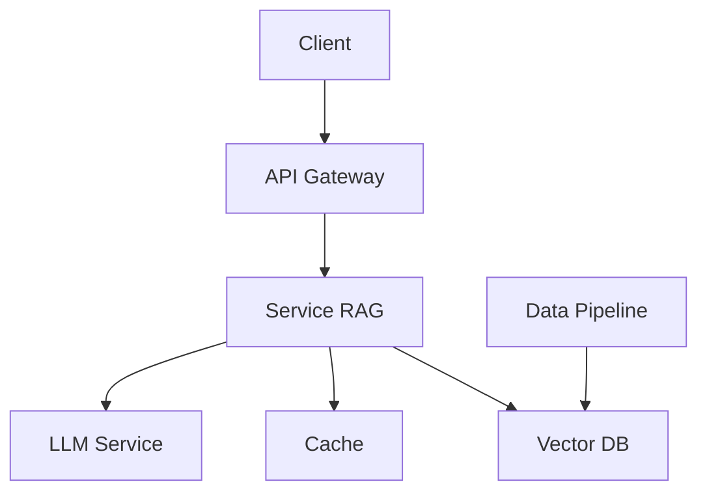

# Architecture du RAG

L'architecture du RAG est conçue pour fournir une solution robuste et évolutive de récupération et de génération augmentée.

## Vue d'Ensemble



## Composants Principaux

### 1. API Gateway
- Gestion des requêtes entrantes
- Authentification et autorisation
- Limitation du débit
- Journalisation des accès

### 2. Service RAG
- Orchestration des composants
- Gestion du contexte
- Fusion des résultats
- Gestion des erreurs

### 3. Base de Données Vectorielle
- Stockage des embeddings
- Recherche par similarité
- Indexation optimisée
- Mise à jour incrémentale

### 4. Cache Redis
- Stockage des résultats fréquents
- Mise en cache des embeddings
- Gestion de la cohérence
- Expiration automatique

### 5. Service LLM
- Génération de texte
- Compréhension du contexte
- Gestion des tokens
- Optimisation des coûts

## Flux de Données

1. **Récupération**
   ```python
   async def retrieve_context(query: str) -> List[Document]:
       # 1. Vérification du cache
       cached = await cache.get(query)
       if cached:
           return cached
       
       # 2. Génération des embeddings
       embedding = await generate_embedding(query)
       
       # 3. Recherche vectorielle
       results = await vector_db.search(embedding)
       
       # 4. Mise en cache
       await cache.set(query, results)
       
       return results
   ```

2. **Génération**
   ```python
   async def generate_response(
       query: str,
       context: List[Document]
   ) -> str:
       # 1. Préparation du contexte
       prepared_context = prepare_context(context)
       
       # 2. Appel au LLM
       response = await llm.generate(
           query=query,
           context=prepared_context
       )
       
       # 3. Post-traitement
       processed_response = post_process(response)
       
       return processed_response
   ```

## Configuration du Système

```yaml
rag:
  vector_db:
    type: "qdrant"
    host: "localhost"
    port: 6333
    collection: "documents"
  
  cache:
    type: "redis"
    host: "localhost"
    port: 6379
    ttl: 3600
  
  llm:
    provider: "openai"
    model: "gpt-4"
    temperature: 0.7
    max_tokens: 2000
```

## Considérations de Performance

- **Latence** : Optimisation des requêtes vectorielles
- **Scalabilité** : Distribution des charges
- **Coûts** : Gestion des tokens LLM
- **Fiabilité** : Redondance des composants

## Prochaines Étapes

- [Implementation](../rag/implementation.md)
- [Best Practices](../../guides/best-practices/rag-best-practices.md) 