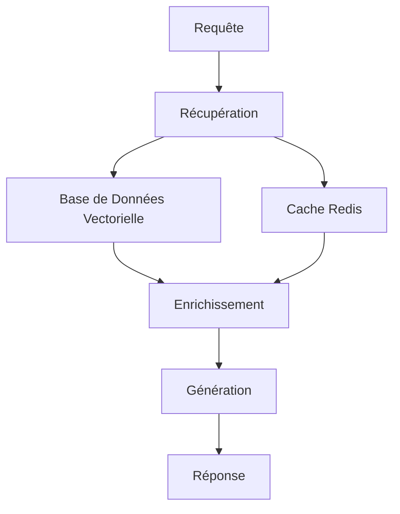

# RAG (Retrieval Augmented Generation)

Le RAG (Retrieval Augmented Generation) est une technique avancée qui combine la génération de texte avec la récupération d'informations pertinentes pour améliorer la qualité et la précision des réponses.

## Fonctionnalités Principales

- **Récupération Contextuelle** : Accès intelligent aux données pertinentes
- **Enrichissement Dynamique** : Amélioration du contexte en temps réel
- **Pondération Intelligente** : Évaluation de la pertinence des sources
- **Support Multi-modèles** : Utilisation optimale des différents modèles de langage

## Architecture



## Cas d'Utilisation

1. **Analyse de Performance**
   - Évaluation des canaux
   - Optimisation des frais
   - Prédiction de tendances

2. **Support Décisionnel**
   - Recommandations d'actions
   - Simulation de scénarios
   - Validation d'hypothèses

## Configuration

```python
from src import AugmentedRAG

rag = AugmentedRAG(
    model_name="gpt-4",
    embedding_model="all-MiniLM-L6-v2",
    vector_db_conn=your_vector_db,
    cache_conn=your_redis_conn
)
```

## Bonnes Pratiques

- Utiliser des requêtes spécifiques et détaillées
- Maintenir un cache à jour
- Optimiser les embeddings
- Surveiller les performances

## Prochaines Étapes

- [Architecture](../rag/architecture.md)
- [Implementation](../rag/implementation.md)
- [Best Practices](../../guides/best-practices/rag-best-practices.md) 