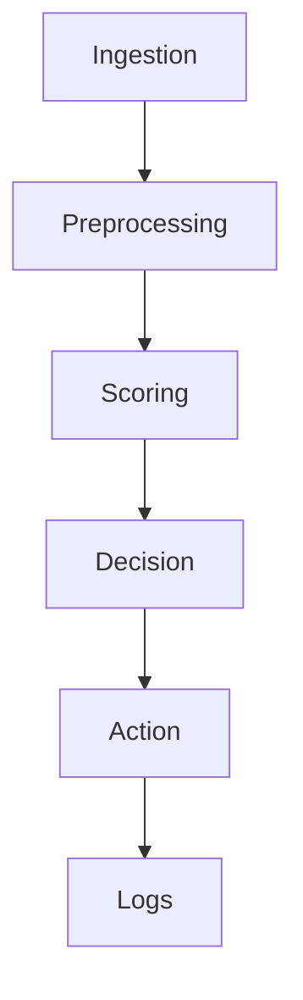

# Documentation de l'architecture
> Dernière mise à jour: 7 mai 2025



# Architecture du Système

## Vue d'ensemble

MCP est un système intégré qui combine deux fonctionnalités principales :
1. Un système avancé de **question-réponse basé sur RAG** (Retrieval-Augmented Generation)
2. Une suite d'outils d'**analyse et d'optimisation pour Lightning Network**

Le système s'appuie sur :
- MongoDB pour le stockage persistant des documents, embeddings et données historiques
- Redis pour le cache multi-niveau et la gestion des requêtes fréquentes
- Llama et OpenAI pour les embeddings et la génération de texte
- Une architecture asynchrone pour les performances et la scalabilité

## Composants principaux

### 1. Système RAG

#### 1.1. Workflow RAG (`rag/rag.py`)
Le cœur du système qui orchestre :
- L'ingestion des documents
- La génération d'embeddings
- La recherche sémantique hybride
- La génération avancée de réponses
- L'évaluation automatique des réponses

#### 1.2. Récupération hybride (`rag/hybrid_retriever.py`)
Combine différentes stratégies de recherche :
- Recherche vectorielle (sémantique)
- Recherche lexicale (mots-clés)
- Fusion pondérée des résultats

#### 1.3. Expansion de requêtes (`rag/query_expansion.py`)
Améliore la récupération en :
- Reformulant la requête initiale
- Générant des requêtes alternatives
- Explorant différentes perspectives

#### 1.4. Génération avancée (`rag/advanced_generator.py`)
Optimise la génération de réponses par :
- Sélection intelligente du contexte
- Structuration des réponses
- Gestion des références et citations

#### 1.5. Cache multi-niveau (`rag/multilevel_cache.py`)
Système de cache sophistiqué pour :
- Réponses complètes
- Résultats de recherche intermédiaires
- Expansions de requêtes
- Invalidation intelligente

#### 1.6. Évaluation RAG (`rag/rag_evaluator.py`)
Évalue automatiquement la qualité des réponses :
- Fidélité au contexte
- Pertinence
- Exhaustivité
- Cohérence

### 2. Intégration Lightning Network

#### 2.1. Client LND/LNBits (`lnbits_client.py`)
Interface avec les nœuds Lightning :
- Communication avec les APIs LND/LNBits
- Gestion des canaux et politiques
- Collecte de métriques en temps réel

#### 2.2. Enrichissement de nœuds (`models/enriched_node.py`)
Centralisation des métadonnées multi-sources :
- Données Amboss (réputation, uptime)
- Données LNRouter (centralité, potentiel de routage)
- Métriques LND/LNBits (canaux, politiques)
- Données Mempool.space (contexte on-chain)

#### 2.3. Gestion de scénarios de test (`test_scenarios.py`)
Framework pour tests A/B sur les nœuds :
- Génération de scénarios
- Déploiement et configuration
- Collecte de métriques
- Analyse comparative

#### 2.4. Optimisation de configuration (`optimize_feustey_config.py`)
Algorithmes d'optimisation pour les nœuds :
- Analyse de performances
- Ajustement heuristique des paramètres
- Boucle de feedback

### 3. Infrastructure partagée

#### 3.1. Gestion des données (`rag/models.py`)
Définit les modèles de données unifiés :
- `Document` : Structure des documents ingérés
- `QueryHistory` : Historique des requêtes
- `SystemStats` : Métriques du système
- `NodeData` : Données des nœuds Lightning

#### 3.2. Opérations MongoDB (`rag/mongo_operations.py`)
Gère toutes les opérations de base de données :
- CRUD des documents et nœuds
- Historique et analyses
- Indexation vectorielle
- Statistiques système

#### 3.3. API REST (`api.py` et `app/routes/`)
Expose les fonctionnalités via HTTP :
- Endpoints RAG (requêtes, ingestion)
- Endpoints Lightning (analyse, optimisation)
- Documentation automatique (Swagger)
- Rate limiting et auth

## Flux de données

### 1. Système RAG avancé
```
                  ┌─────────────┐
                  │  Requête    │
                  └──────┬──────┘
                         │
                         ▼
┌──────────────┐    ┌────────────┐    ┌────────────┐
│  Cache L1    │◄───┤ Prétraitement├──►│ Expansion  │
│ (Réponses)   │    │              │    │ de requêtes│
└───────┬──────┘    └──────┬───────┘    └─────┬──────┘
        │                  │                   │
        │ Cache            │                   │
        │ Miss             ▼                   ▼
        │           ┌──────────────┐    ┌──────────────┐
        │           │  Cache L2    │    │ Embedding    │
        │           │ (Recherche)  │    │ vectoriel    │
        │           └───────┬──────┘    └──────┬───────┘
        │                   │                  │
        │                   │                  │
        │                   ▼                  ▼
        │            ┌─────────────────────────────────┐
        │            │     Recherche hybride           │
        │            │  (Vectorielle + Lexicale)       │
        │            └──────────────┬──────────────────┘
        │                           │
        │                           ▼
        │                   ┌───────────────┐
        │                   │  Reranking    │
        │                   │  des résultats│
        │                   └───────┬───────┘
        │                           │
        │                           ▼
        │                   ┌───────────────┐     ┌────────────┐
        │                   │  Génération   │     │ Évaluation │
        └──────────────────►│  de réponse   ├────►│ RAG        │
                            └───────┬───────┘     └────────────┘
                                    │
                                    ▼
                            ┌───────────────┐
                            │   Réponse     │
                            └───────────────┘
```

### 2. Intégration Lightning Network
```
┌─────────────────┐     ┌────────────────┐     ┌─────────────────┐
│ Données Amboss  │     │ Données LND/   │     │ Données LNRouter│
│ (API externe)   │     │ LNBits         │     │ (API externe)   │
└────────┬────────┘     └────────┬───────┘     └────────┬────────┘
         │                       │                      │
         │                       │                      │
         ▼                       ▼                      ▼
┌────────────────────────────────────────────────────────────────┐
│                    EnrichedNode                                 │
│                                                                 │
│  ┌─────────────┐   ┌─────────────┐    ┌─────────────────────┐  │
│  │ Réputation  │   │ Données     │    │ Métriques de       │  │
│  │ et uptime   │   │ des canaux  │    │ centralité réseau  │  │
│  └─────────────┘   └─────────────┘    └─────────────────────┘  │
└────────────────────────────┬─────────────────────────────────┬─┘
                             │                                 │
                             ▼                                 ▼
                     ┌───────────────┐               ┌─────────────────┐
                     │ Test A/B      │               │ Optimisation    │
                     │ des scénarios │               │ de la config    │
                     └───────┬───────┘               └─────────┬───────┘
                             │                                 │
                             │                                 │
                             ▼                                 ▼
                     ┌───────────────┐               ┌─────────────────┐
                     │ Évaluation    │───────────────│ Ajustements     │
                     │ des résultats │               │ des paramètres  │
                     └───────────────┘               └─────────────────┘
```

## Sécurité

- Authentification JWT pour l'API
- Validation des entrées avec Pydantic
- Connexions sécurisées aux bases de données
- Gestion des secrets via variables d'environnement
- Limitations d'accès aux données sensibles des nœuds

## Performance

- Architecture asynchrone de bout en bout
- Cache multi-niveau intelligent
- Parallélisation des requêtes API externes
- Indexation vectorielle optimisée
- Batching des opérations de base de données

## Monitoring

- Métriques RAG (précision, temps de réponse, taux de hit du cache)
- Métriques Lightning (performances des nœuds, évolution dans le temps)
- Logs structurés avec niveaux de sévérité
- Système d'alertes configurable
- Tableaux de bord pour visualisation des performances

## Extensibilité

- Architecture modulaire avec interfaces bien définies
- Imports conditionnels pour les modules optionnels
- Support pour différents modèles de LLM (Llama, OpenAI, etc.)
- Intégration facile de nouvelles sources de données Lightning
- API extensible avec versioning
