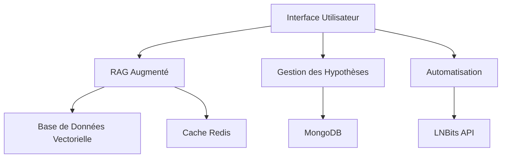

# Introduction à MCP

MCP (Management and Control Platform) est une plateforme avancée pour la gestion et l'optimisation des réseaux Lightning. Elle combine des techniques modernes de RAG (Retrieval Augmented Generation) avec des capacités d'automatisation pour offrir une solution complète de gestion de réseau.

## Fonctionnalités Principales

### RAG Augmenté
- Récupération contextuelle avancée
- Enrichissement dynamique du contexte
- Pondération intelligente des sources
- Support multi-modèles

### Gestion des Hypothèses
- Simulation de changements de frais
- Optimisation de la configuration des canaux
- Évaluation prédictive des impacts
- Validation automatique des hypothèses

### Automatisation
- Gestion des frais automatisée
- Rééquilibrage intelligent des canaux
- Optimisation continue du réseau
- Intégration avec LNBits

## Architecture

## Cas d'Utilisation

### Optimisation des Frais
1. Analyse des performances actuelles
2. Génération d'hypothèses de frais
3. Simulation des impacts
4. Application des changements optimaux

### Gestion des Canaux
1. Analyse de la topologie du réseau
2. Identification des opportunités
3. Simulation des modifications
4. Mise en œuvre des changements

## Prérequis

- Python 3.8+
- MongoDB 4.4+
- Redis 6.0+
- Accès à l'API OpenAI
- Instance LNBits (optionnel)

## Prochaines Étapes

- [Installation](installation.md)
- [Guide de Démarrage Rapide](quickstart.md)
- [Concepts Fondamentaux](../concepts/rag/overview.md) 