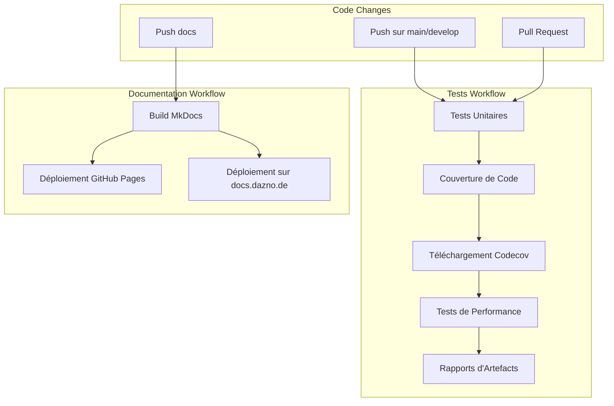

# Workflows GitHub Actions

Ce document détaille les différents workflows GitHub Actions utilisés dans le projet MCP pour automatiser les tests, l'analyse de couverture et le déploiement de la documentation.

## Vue d'ensemble des Workflows



## Workflow de Tests

Le workflow de tests est défini dans le fichier [.github/workflows/tests.yml](../.github/workflows/tests.yml).

### Déclencheurs

Le workflow est déclenché dans les cas suivants :
- Push sur les branches `main` et `develop`
- Pull Requests vers les branches `main` et `develop`

### Services Intégrés

Le workflow configure automatiquement :
- **MongoDB** (version 4.4) exposé sur le port 27017
- **Redis** (version 6.0) exposé sur le port 6379

### Étapes du Workflow

1. **Configuration de l'environnement**
   - Checkout du code
   - Configuration de Python 3.9
   - Installation des dépendances

2. **Exécution des tests avec couverture**
   - Exécution de pytest avec génération de rapport de couverture
   - Variables d'environnement configurées pour les tests

3. **Téléchargement du rapport de couverture**
   - Utilisation de l'action Codecov pour télécharger le rapport
   - Artefact de couverture sauvegardé pour analyse future

4. **Tests de performance**
   - Exécution de tests de charge dans un job séparé
   - Dépend de la réussite des tests unitaires
   - Génération de graphiques et métriques

### Variables d'Environnement

```yaml
MONGODB_URI: mongodb://localhost:27017/mcp_test
REDIS_URL: redis://localhost:6379/1
OPENAI_API_KEY: ${{ secrets.TEST_OPENAI_KEY }}
ENVIRONMENT: test
```

## Workflow de Documentation

Le workflow de documentation est défini dans le fichier [.github/workflows/docs.yml](../.github/workflows/docs.yml).

### Déclencheurs

Le workflow est déclenché uniquement lors des push sur la branche `main` qui modifient :
- Le dossier `docs/`
- Le fichier `mkdocs.yml`
- Le workflow lui-même

### Étapes du Workflow

1. **Configuration de l'environnement**
   - Checkout du code
   - Configuration de Python 3.8
   - Installation des plugins MkDocs

2. **Construction de la documentation**
   - Exécution de `mkdocs build` en mode strict

3. **Déploiement sur GitHub Pages**
   - Utilisation de l'action `peaceiris/actions-gh-pages`
   - Publication du dossier `site/`

4. **Déploiement sur serveur personnalisé**
   - Utilisation de l'action `appleboy/scp-action`
   - Transfert des fichiers vers `docs.dazno.de`

### Secrets Utilisés

- `GITHUB_TOKEN` : Token automatiquement fourni par GitHub
- `DOCS_HOST` : Nom d'hôte du serveur de documentation
- `DOCS_USERNAME` : Nom d'utilisateur pour la connexion SSH
- `DOCS_SSH_KEY` : Clé SSH pour l'authentification

## Bonnes Pratiques Implémentées

1. **Isolation des environnements**
   - Utilisation de services conteneurisés pour les tests
   - Configuration spécifique pour les tests

2. **Parallélisation des tâches**
   - Tests unitaires et de performance exécutés séparément
   - Dépendances entre les jobs pour optimiser l'exécution

3. **Artefacts et rapports**
   - Sauvegarde des rapports de couverture
   - Sauvegarde des résultats de performance

4. **Sécurité**
   - Utilisation de secrets pour les données sensibles
   - Permissions minimales pour les tokens 